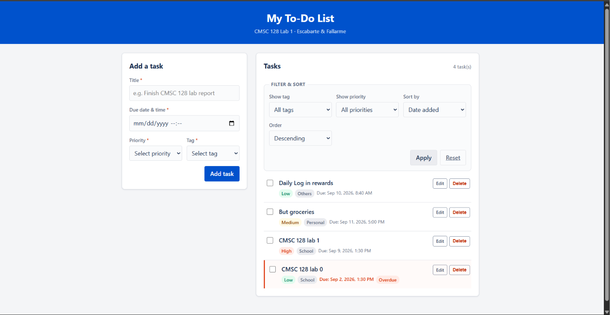
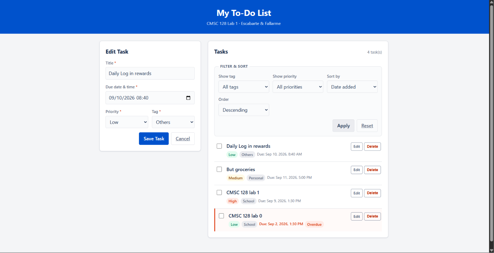
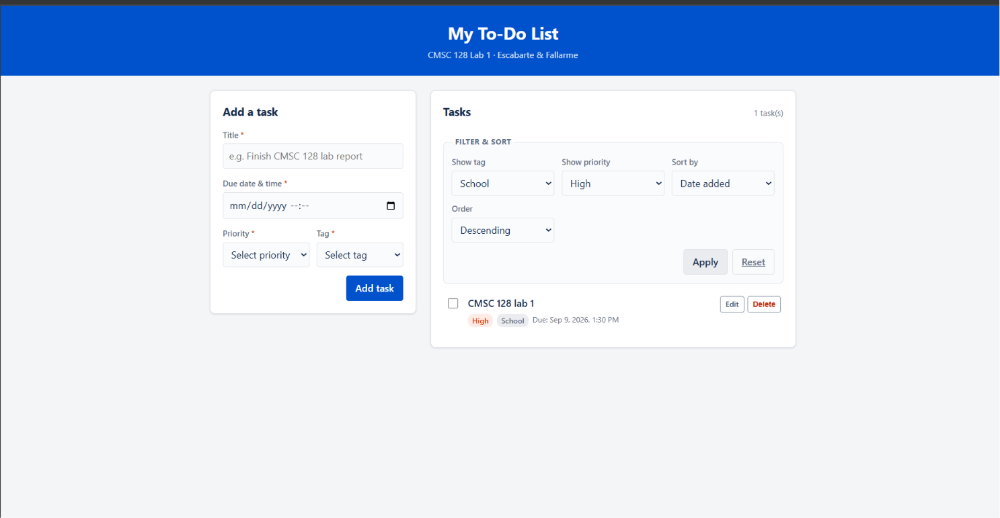
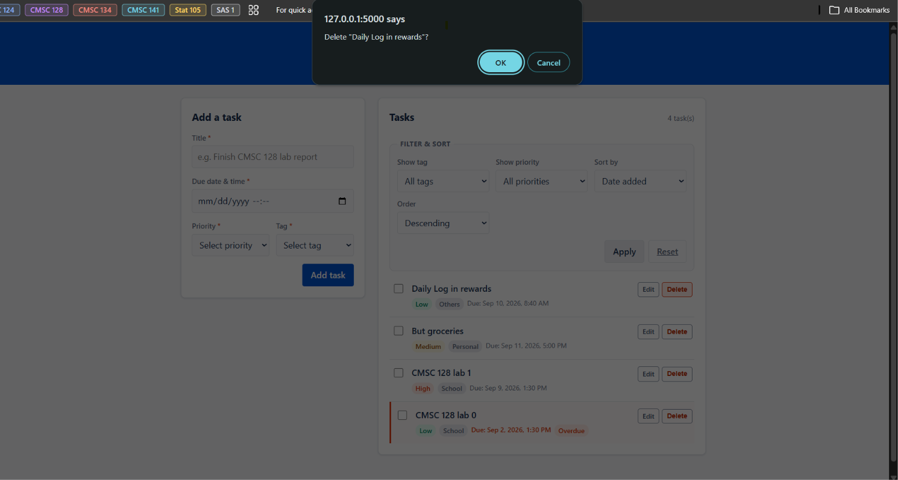
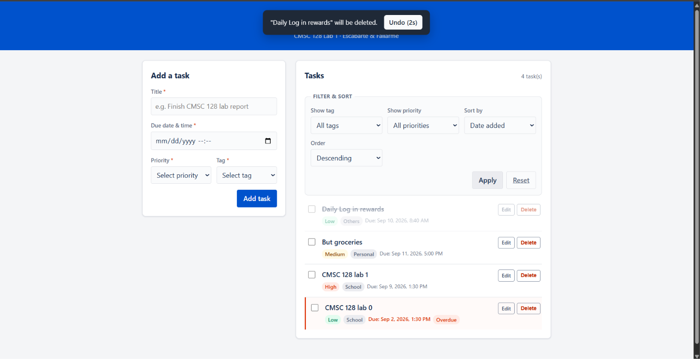

# CMSC 128 Lab 1 — To-Do List (CRUD)

A simple To-Do List web application implementing the four basic CRUD operations, built for CMSC 128 Laboratory Activity 1.

**Status:** Working

## Authors

- Ralph Ryan T. Escabarte (RalphREE)
- John Matthew N. Fallarme (Matty-05)

## Tech Stack

| Layer | Technology |
| --- | --- |
| Frontend | HTML / CSS / JavaScript |
| Backend | Flask (Python) |
| Database | SQLite |

We chose HTML/CSS/JS + Flask + SQLite because it is the simplest option for
a small app like this, and we are both already comfortable with Python.
Flask is small enough that we write the routing and CRUD logic ourselves,
and SQLite is just a single file, so there is no separate database server
to set up.

## Project Structure

```
.
├── app.py                  # Flask application — routes and CRUD logic
├── requirements.txt        # Python dependencies
├── .gitignore
├── database/
│   └── schema.sql          # SQLite table definitions
├── templates/              # Jinja2 HTML templates
│   ├── _tasks_panel.html   # Task list + filter/sort controls, shared by both pages
│   ├── index.html          # Task list + add-task form
│   └── edit.html           # Edit-task form
└── static/
    ├── css/style.css
    └── js/main.js
```

## Setup

### Requirements

- Python 3.10 or newer
- Git

### Installation

Clone the repository and move into it:

```bash
git clone https://github.com/Matty-05/cmsc128-Lab1_CRUD_Escabarte_Fallarme
cd cmsc128-Lab1_CRUD_Escabarte_Fallarme
```

Create and activate a virtual environment:

```bash
# Windows (Command Prompt / PowerShell)
python -m venv venv
venv\Scripts\activate

# Windows (Git Bash)
python -m venv venv
source venv/Scripts/activate

# macOS / Linux
python3 -m venv venv
source venv/bin/activate
```

Your prompt should now be prefixed with `(venv)`.

Install dependencies:

```bash
pip install -r requirements.txt
```

### Running the app

```bash
python app.py
```

Then open http://127.0.0.1:5000 in a browser.

The SQLite database file (`database/todo.db`) is created automatically on first run and is **not** tracked by Git — each developer gets their own local copy.

### Notes for collaborators

- Re-run the activate command in every new terminal session.
- `venv/` and `database/todo.db` are gitignored on purpose — don't commit them.
- If you install a new package, add it to `requirements.txt` and commit that file.

## Features

- [x] To-do list interface
- [x] Add task (title, due date and time, priority, tag)
- [x] Edit task
- [x] Delete task with confirmation dialog
- [x] Mark task as done
- [x] Data persistence across restarts
- [x] Undo option when deleting
- [x] Filter and sort

## Data Operations

| Method | Route            | Function         | Description                    |
| ------ | ---------------- | ---------------- | ------------------------------ |
| GET    | `/`              | `index`          | List all tasks                 |
| POST   | `/add`           | `add_task`       | Create a new task              |
| GET    | `/edit/<id>`     | `edit_task_form` | Fetch one task for editing     |
| POST   | `/edit/<id>`     | `edit_task`      | Update an existing task        |
| POST   | `/toggle/<id>`   | `toggle_task`    | Mark a task done or not done   |
| POST   | `/delete/<id>`   | `delete_task`    | Delete a task                  |

A missing `<id>` returns **404**. Every write redirects back to the list,
carrying the current query string so the active filter and sort survive the
action.

### Filter and Sort Parameters

Filtering and sorting are query parameters read by `get_filtered_tasks()`.
They work on both `/` and `/edit/<id>`, since both pages render the same task
list.

| Parameter         | Accepted values                                      | Default      |
| ----------------- | ---------------------------------------------------- | ------------ |
| `filter_tag`      | `School`, `Personal`, `Others` (omit for all)         | all tags     |
| `filter_priority` | `High`, `Medium`, `Low` (omit for all)                | all          |
| `sort_by`         | `created_at`, `due_date`, `title`, `tag`, `priority`  | `created_at` |
| `sort_order`      | `asc`, `desc`                                         | `desc`       |

Both sort parameters are validated against an allowlist before being used —
`sort_by` must be a key of `SORT_COLUMNS` and `sort_order` must be `asc` or
`desc`, otherwise the default is used. This matters because the column and
direction are interpolated into the SQL string rather than passed as bound
parameters. Filter values *are* passed as bound parameters (`?` placeholders).

Priority sorts by rank rather than alphabetically (High > Medium > Low), so
`sort_by=priority&sort_order=desc` puts High-priority tasks first. Titles sort
case-insensitively via `COLLATE NOCASE`.

**Examples**

```
/?filter_tag=School                          School tasks only
/?sort_by=due_date&sort_order=asc            soonest deadline first
/?sort_by=priority&sort_order=desc           High priority first
/?filter_priority=High&sort_by=due_date&sort_order=asc
                                             urgent tasks, soonest first
/edit/3?filter_tag=School                    edit task 3, list filtered
```

## Screenshots

To-Do list main page



To-Do list when editing task



To-Do list with the sort and filter option



Delete Confirmation



Undo 



