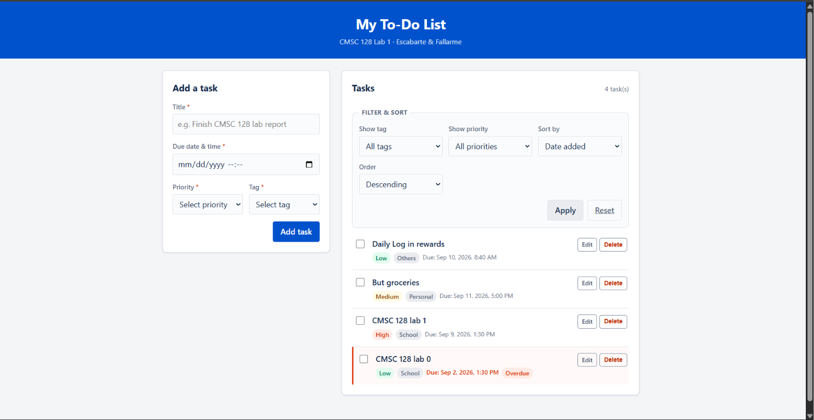
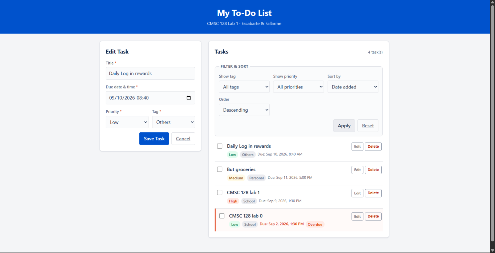
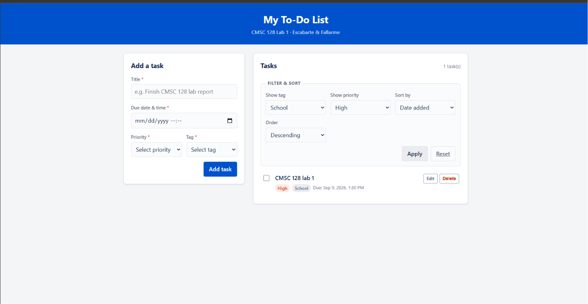
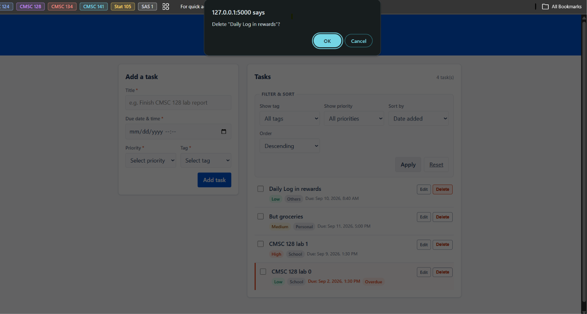
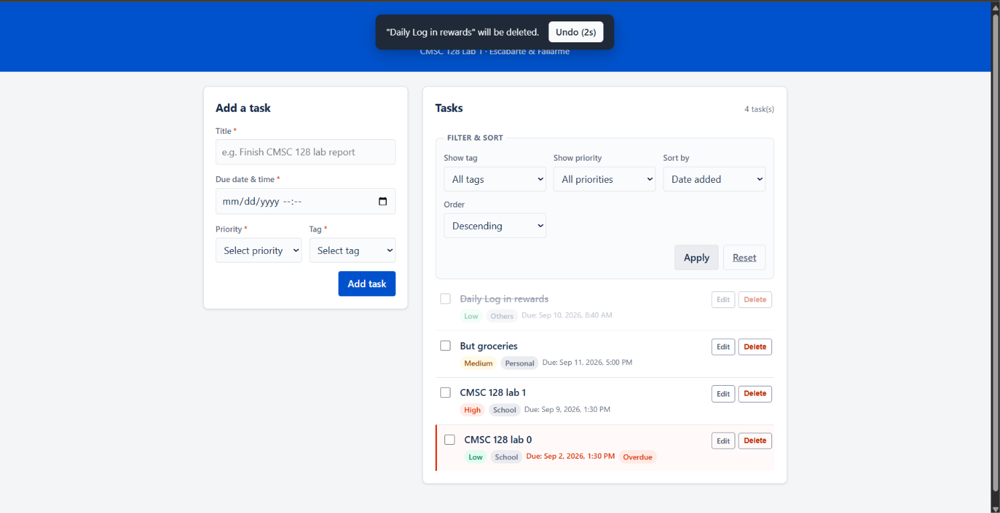

# CMSC 128 Lab 2 — To-Do List with User Accounts

A To-Do List web application with user accounts, built for CMSC 128 Laboratory Activities 1 and 2. Lab 1 added the four CRUD operations for tasks. Lab 2 adds registration, login, logout, persistent sessions, a profile page, and password recovery.

**Status:** Working

## Authors

- Ralph Ryan T. Escabarte (RalphREE)
- John Matthew N. Fallarme (Matty-05)

## Tech Stack

| Layer | Technology |
| --- | --- |
| Frontend | HTML / CSS / JavaScript, Jinja2 templates |
| Backend | Flask (Python) |
| Database | SQLite |
| Authentication | Werkzeug password hashing (scrypt), Flask signed-cookie sessions, `python-dotenv` for the secret key |

We chose HTML/CSS/JS + Flask + SQLite because it is the simplest option for
a small app like this, and we are both already comfortable with Python.
Flask is small enough that we write the routing and CRUD logic ourselves,
and SQLite is just a single file, so there is no separate database server
to set up.

For accounts we used what Flask already provides instead of adding a large
auth library, so we can explain every step ourselves:

- **Passwords** are hashed with Werkzeug's `generate_password_hash()` (scrypt with a random salt) and checked with `check_password_hash()`. Werkzeug is installed together with Flask.
- **Sessions** use Flask's built-in `session`, a cookie signed with `SECRET_KEY`.
- **`SECRET_KEY`** is loaded from a `.env` file with `python-dotenv`, so it is never committed to GitHub.

## Project Structure

```
.
├── app.py                    # Flask application: routes, CRUD, auth, sessions
├── validators.py             # Shared validation helpers (required fields, username, email, password)
├── requirements.txt          # Python dependencies
├── .env.example              # Variable names only; copy to .env and set your own values
├── .gitignore
├── database/
│   └── schema.sql            # SQLite tables: tasks, users, password_resets
├── templates/                # Jinja2 HTML templates
│   ├── _header.html          # Shared header: greeting, navigation, Log out
│   ├── _tasks_panel.html     # Task list + filter/sort controls, shared by both task pages
│   ├── index.html            # Task list + add-task form
│   ├── edit.html             # Edit-task form
│   ├── signup.html           # Create an account
│   ├── login.html            # Log in
│   ├── profile.html          # Update account details and password
│   ├── forgot_password.html  # Request a password reset link
│   └── reset_password.html   # Set a new password from a reset link
└── static/
    ├── css/style.css
    └── js/main.js            # Overdue badges, delete undo, Show/Hide password, unsaved-changes warning
```

## Setup

### Requirements

- Python 3.10 or newer
- Git

### Installation

Clone the repository, move into it, and switch to the Lab 2 branch:

```bash
git clone https://github.com/Matty-05/cmsc128-Lab1_CRUD_Escabarte_Fallarme
cd cmsc128-Lab1_CRUD_Escabarte_Fallarme
git checkout act2-accounts
```

Create and activate a virtual environment:

```bash
# Windows (Command Prompt / PowerShell)
python -m venv venv
venv\Scripts\activate

# Windows (Git Bash)
python -m venv venv
source venv/Scripts/activate

# macOS / Linux
python3 -m venv venv
source venv/bin/activate
```

Your prompt should now be prefixed with `(venv)`.

Install dependencies:

```bash
pip install -r requirements.txt
```

### Environment variables

The app needs a `SECRET_KEY` to sign session cookies. It **will not start** without one.

1. Copy the example file:

   ```bash
   cp .env.example .env
   ```

   (On Command Prompt, use `copy .env.example .env`.)

2. Generate a random key:

   ```bash
   python -c "import secrets; print(secrets.token_hex(32))"
   ```

3. Open `.env` and replace `change-me` with the generated key:

   ```
   SECRET_KEY=your-generated-key-here
   ```

`.env` is listed in `.gitignore`, so your key is never committed. Only `.env.example` (with a placeholder) is in the repository.

### Running the app

```bash
python app.py
```

Then open http://127.0.0.1:5000 in a browser.

The SQLite database file (`database/todo.db`) is created automatically on first run and is **not** tracked by Git — each developer gets their own local copy. On every start, `init_db()` runs `schema.sql`, which creates any missing tables (`tasks`, `users`, `password_resets`) without touching existing data.

Run the app with `python app.py`, not `flask run`, because `init_db()` only runs from `app.py`.

### Notes for collaborators

- Re-run the activate command in every new terminal session.
- `venv/`, `database/todo.db`, and `.env` are gitignored on purpose — don't commit them.
- If you install a new package, add it to `requirements.txt` and commit that file.

## Features

**Tasks (Lab 1)**

- [x] To-do list interface
- [x] Add task (title, due date and time, priority, tag)
- [x] Edit task
- [x] Delete task with confirmation dialog
- [x] Mark task as done
- [x] Data persistence across restarts
- [x] Undo option when deleting
- [x] Filter and sort

**Accounts (Lab 2)**

- [x] Sign up with display name, username, email, and password, with validation and duplicate checks
- [x] Passwords stored only as salted hashes
- [x] Log in with a clear error for wrong credentials
- [x] Log out that ends the session, including after pressing Back
- [x] Stay logged in after refresh, back/forward navigation, and a server restart
- [x] Header shows who is logged in and which page you are on
- [x] Profile page: change display name, username, and password
- [x] Warning before leaving Profile with unsaved changes
- [x] Password recovery with time-limited, single-use reset links (demo mode, see below)

## Data Operations

### Task routes

| Method | Route            | Function         | Description                    |
| ------ | ---------------- | ---------------- | ------------------------------ |
| GET    | `/`              | `index`          | List all tasks                 |
| POST   | `/add`           | `add_task`       | Create a new task              |
| GET    | `/edit/<id>`     | `edit_task_form` | Fetch one task for editing     |
| POST   | `/edit/<id>`     | `edit_task`      | Update an existing task        |
| POST   | `/toggle/<id>`   | `toggle_task`    | Mark a task done or not done   |
| POST   | `/delete/<id>`   | `delete_task`    | Delete a task                  |

A missing `<id>` returns **404**. Every write redirects back to the list,
carrying the current query string so the active filter and sort survive the
action.

Tasks are not linked to users yet. Owner-based access control (each user sees only their own tasks) is the next activity.

### Account routes

| Method   | Route                     | Function          | Description |
| -------- | ------------------------- | ----------------- | ----------- |
| GET      | `/signup`                 | `register_form`   | Show the sign up form (logged-in users are sent to Profile) |
| POST     | `/signup`                 | `register`        | Validate, hash the password, create the account, and log in |
| GET/POST | `/login`                  | `login`           | Show the login form / check the password and start a session |
| POST     | `/logout`                 | `logout`          | Clear the session (GET returns 405) |
| GET      | `/profile`                | `profile_form`    | Show the profile page (login required) |
| POST     | `/profile`                | `update_profile`  | `action=details` updates name and username; `action=password` changes the password (login required) |
| GET/POST | `/forgot-password`        | `forgot_password` | Request a password reset link by username or email |
| GET/POST | `/reset-password/<token>` | `reset_password`  | Show the reset form / set a new password if the token is valid |

### Database tables

| Table | Columns | Purpose |
| ----- | ------- | ------- |
| `tasks` | `id`, `title`, `due_date`, `priority`, `tag`, `is_done`, `created_at` | To-do items (Lab 1) |
| `users` | `id`, `username` (unique), `email` (unique), `display_name`, `password_hash`, `created_at` | Accounts |
| `password_resets` | `id`, `user_id` → `users.id`, `token_hash` (unique), `expires_at`, `used` | Password reset requests |

### Filter and Sort Parameters

Filtering and sorting are query parameters read by `get_filtered_tasks()`.
They work on both `/` and `/edit/<id>`, since both pages render the same task
list.

| Parameter         | Accepted values                                      | Default      |
| ----------------- | ---------------------------------------------------- | ------------ |
| `filter_tag`      | `School`, `Personal`, `Others` (omit for all)         | all tags     |
| `filter_priority` | `High`, `Medium`, `Low` (omit for all)                | all          |
| `sort_by`         | `created_at`, `due_date`, `title`, `tag`, `priority`  | `created_at` |
| `sort_order`      | `asc`, `desc`                                         | `desc`       |

Both sort parameters are validated against an allowlist before being used —
`sort_by` must be a key of `SORT_COLUMNS` and `sort_order` must be `asc` or
`desc`, otherwise the default is used. This matters because the column and
direction are interpolated into the SQL string rather than passed as bound
parameters. Filter values *are* passed as bound parameters (`?` placeholders).

Priority sorts by rank rather than alphabetically (High > Medium > Low), so
`sort_by=priority&sort_order=desc` puts High-priority tasks first. Titles sort
case-insensitively via `COLLATE NOCASE`.

**Examples**

```
/?filter_tag=School                          School tasks only
/?sort_by=due_date&sort_order=asc            soonest deadline first
/?sort_by=priority&sort_order=desc           High priority first
/?filter_priority=High&sort_by=due_date&sort_order=asc
                                             urgent tasks, soonest first
/edit/3?filter_tag=School                    edit task 3, list filtered
```

## Registration and Profile

### Sign up

1. `POST /signup` reads display name, username, email, password, and confirm password. Text fields are trimmed, and the email is stored in lowercase.
2. `validators.py` checks each field:
   - every field is required (`validate_required`)
   - username: 3–30 characters, letters, numbers, and underscores (`is_valid_username`)
   - email: a basic `name@domain.tld` shape (`is_valid_email`)
   - password: at least 8 characters (`password_error`), and both password fields must match
3. The database is checked for a duplicate username (case-insensitive) or email.
4. If anything fails, the form is shown again with a message under each field, keeping what the user typed (except passwords).
5. If everything passes, the password is hashed with `generate_password_hash()` and the account is inserted into `users`. The `UNIQUE` constraints are a backstop if two sign-ups with the same username arrive at once.
6. The new user is logged in (`session.clear()`, then `session["user_id"]`) and sent to Profile with *"Your account was created. Welcome!"*

### Profile

The Profile page (`@login_required`) has two separate forms, so an error in one never discards changes in the other. Both post to `/profile`, and a hidden `action` field tells the route which one was sent.

- **Account details** (`action=details`): updates display name and username. The username must be valid and not used by **another** account (the user's own row is ignored, so keeping the same username is allowed). The header updates right away because it reads the name from the database on every request.
- **Change password** (`action=password`): requires the current password (checked with `check_password_hash()`), a new password of at least 8 characters, and a matching confirmation. The new password is hashed before it is saved.
- Success shows a green message; errors appear under the related field.
- **Discard changes** resets the details form. If either form has unsaved edits, the browser asks *"Leave site?"* before navigating away (`beforeunload` in `main.js`, only on forms marked `data-warn-unsaved`).

## Inspecting the Database

We use the **SQLite Viewer** extension for VS Code (by Florian Klampfer) to inspect accounts.

1. In VS Code, open Extensions (Ctrl+Shift+X), search **SQLite Viewer**, and install it.
2. In the file explorer, click `database/todo.db`. It opens as a table view.
3. Open the `users` table. The `password_hash` column shows values like `scrypt:32768:8:1$...`, a salted hash, never the plain password.
4. Open `password_resets` to see reset requests: only a hash of each token is stored, with its expiry time and whether it was used.

The extension reads the same SQLite file the Flask app opens in `get_db()`, so changes made in the app appear after refreshing the view.

## Screenshots

To-Do list main page



To-Do list when editing task



To-Do list with the sort and filter option



Delete Confirmation



Undo 



## Session Handling

Logging in is handled with Flask's built-in `session`, which is stored in a **signed cookie** in the browser.

**How a login creates the session**

1. `POST /login` looks up the user by username (case-insensitive).
2. `check_password_hash()` compares the typed password with the stored hash. Passwords are never stored or compared in plain text.
3. If the username or password is wrong, the page shows one message, *"Incorrect username or password."*, so it does not reveal which usernames exist.
4. On success, `session.clear()` removes anything left from an earlier session, then `session["user_id"]` is set to the user's id.
5. The user is redirected to the Profile page.

**How the session stays valid**

- The cookie is signed with `SECRET_KEY`, which is loaded from `.env` (see `.env.example`). If anyone edits the cookie, the signature no longer matches and Flask ignores it.
- Because the session lives in the browser's cookie, not in the server's memory, the user **stays logged in after a refresh, back/forward navigation, and a server restart**. After a restart the server still has the same `SECRET_KEY`, so the old cookie is still valid.
- The app fails to start if `SECRET_KEY` is missing (`os.environ["SECRET_KEY"]`), so it never runs with a guessable default key.

**How pages use the session**

- `load_logged_in_user()` (`@app.before_request`) runs before every request and loads the logged-in user's row into `g.user`. The header uses it to show *"Hello, &lt;display name&gt;"*, the current page, and the Log out button.
- `@login_required` protects pages such as `/profile`. If there is no `user_id` in the session, it redirects to `/login`.
- A logged-in user who opens `/login` or `/signup` is redirected to Profile.

**How logout ends the session**

- `POST /logout` calls `session.clear()` and redirects to `/login`. It only accepts POST, so a link or a typed URL cannot log someone out by accident (a GET returns 405).
- `@app.after_request` adds `Cache-Control: no-store` to every page shown while logged in, so the browser does not keep a copy of private pages.
- Some browsers (Brave, Chrome) can still restore the previous page from memory when you press Back. A small script in `_header.html` reloads a page if it was restored this way (`pageshow` with `event.persisted`), so the server checks the session again and redirects to `/login`.

## Password Recovery

### How it works

1. **Request a link.** On the login page, click **Forgot password?** and enter a username or email (`POST /forgot-password`).
2. **Create a token.** If an account matches, the app creates a random token with `secrets.token_urlsafe(32)` and saves a row in the `password_resets` table with:
   - `user_id`: whose password it resets
   - `token_hash`: a SHA-256 hash of the token (the token itself is never stored)
   - `expires_at`: 15 minutes from now
   - `used`: 0 until the link is used
3. **Open the link.** `GET /reset-password/<token>` hashes the token from the URL and looks for a matching row that is not used and not expired. If none is found, the page says the link is invalid, used, or expired, and offers a button to request a new one.
4. **Set a new password.** `POST /reset-password/<token>` checks the token again, then validates the new password (required, at least 8 characters, both fields match).
5. **Save it.** The new password is hashed with `generate_password_hash()` and **replaces** the old hash in `users.password_hash`. All of that user's reset tokens are marked as used, and the session is cleared.
6. **Log in again.** The user is sent to `/login` with a success message. The **new password works and the old password is rejected**, because the old hash no longer exists.

The same message (*"If an account matches, a reset link has been created."*) is shown whether or not the account exists.

### Demo mode (no email)

This app does **not send email**. Instead, the reset link is **shown on the Forgot password page** in a box labelled *"Demo mode"*. A real application would email the link to the account's address instead.

**Security limitations of demo mode**

- **Anyone who knows a username or email can reset that account's password**, because the link is shown to whoever submits the form, not sent to the account owner's inbox. This is acceptable only for a local demo.
- **It reveals which accounts exist.** The confirmation message is the same for every request, but the link only appears when the account exists.
- The other protections still apply: the token is random and cannot be guessed, it works only once, it expires after 15 minutes, and only its hash is stored in the database.

To make this production-ready, the app would email the link (for example with Flask-Mail and SMTP credentials stored in `.env`) and never show it on the page.


